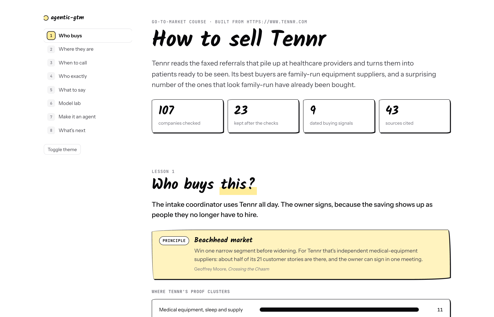
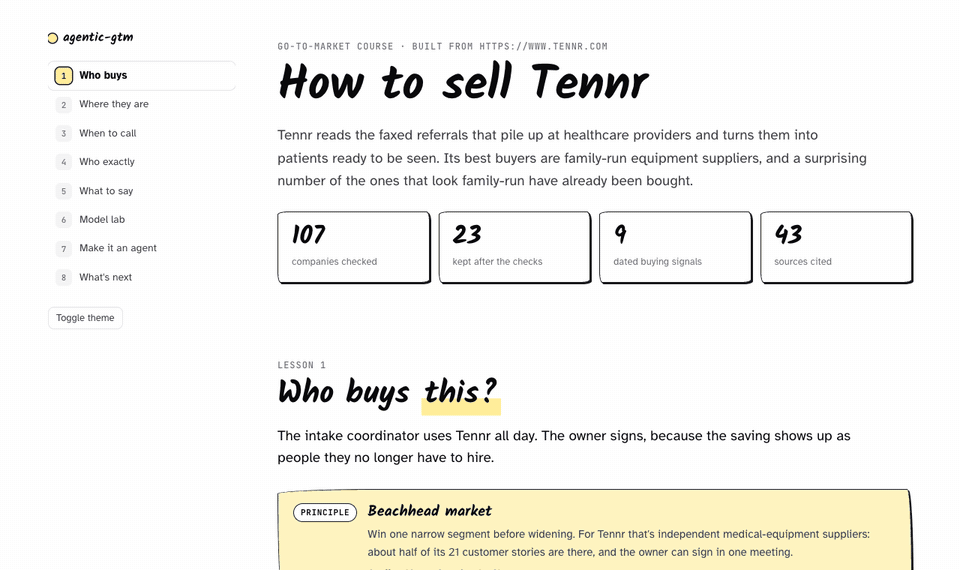
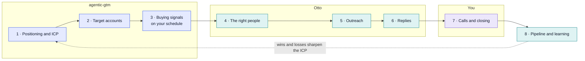

# agentic-gtm

**A Claude skill that teaches you how to find customers for your startup, and an agent that keeps finding them on a schedule you set.**

Give it your URL. It researches your market and gives you a short interactive course on finding customers, built on your own company: who buys, around 20 real companies to go after, the buying signals that say "now", and a first message you could send tomorrow. Then it hands you an agent that re-checks your market on your schedule and brings you the accounts worth contacting, with a draft message for each.

```
/agentic-gtm https://yourstartup.com
```

<picture>
  <source media="(prefers-color-scheme: dark)" srcset="docs/hero-dark.png">
  
</picture>



**Examples:** [Finding customers for Tennr](https://amaan-creates.github.io/agentic-gtm/examples/tennr/course.html) (YC W23) · [Finding customers for Greptile](https://amaan-creates.github.io/agentic-gtm/examples/greptile/course.html) (YC W24) · [Finding customers for Lindus Health](https://amaan-creates.github.io/agentic-gtm/examples/lindus-health/course.html) (London, life sciences, mid-pivot)

## Get started

**1. Install it** (in Claude Code)

```
/plugin marketplace add Amaan-creates/agentic-gtm
/plugin install agentic-gtm@agentic-gtm
```

<details><summary>Or install by hand</summary>

```bash
git clone https://github.com/Amaan-creates/agentic-gtm.git
cp -r agentic-gtm/.claude/skills/agentic-gtm ~/.claude/skills/
```
Then run it as `/agentic-gtm`.
</details>

**2. Run it on your startup**

```
/agentic-gtm:agentic-gtm https://yourstartup.com
```

It researches for a while, then opens your course in the browser. Everything lands in a folder called `agentic-gtm-yourstartup/`.

**3. Read your course**

Eight short lessons, each built on your market and ending with a quick quiz. About 20 minutes.

**4. Put the agent on a schedule**

```bash
cd agentic-gtm-yourstartup/agent
cp .env.example .env      # add your Anthropic API key, pick your schedule
bash launch.sh            # sets up the agent and its schedule, then runs once now
python3 report.py         # download the latest report
```

**5. Take it further with Otto** (optional). Connect [Otto](https://otto-pilot.io) to find the right people at each account and run the outreach. [See below](#take-it-further-with-otto).

## What's in your course

| # | Lesson | What you get |
|---|---|---|
| 1 | **Who buys this?** | Your ideal customer profile and 2 to 4 buyer personas, including who signs, with the evidence behind them |
| 2 | **Where are they?** | Around 20 real companies to go after, each checked: right company, still independent, not already a customer or a competitor's |
| 3 | **When are they ready?** | 3 to 5 buying signals, each with a live, dated example from your own list |
| 4 | **Who exactly?** | The roles to reach at each company, and how to confirm someone is still there |
| 5 | **What do you say?** | A first message built on a real signal, next to the generic one everyone sends |
| 6 | **Model lab** | The same job run on Claude Haiku, Sonnet and Opus, with real cost, time and accuracy on your data |
| 7 | **Make it an agent** | Your agent, ready to run on the schedule you set |
| 8 | **What happens next?** | How to turn the plan into campaigns |

Every fact is cited, so you can check it in one click.

## Where it fits in the 0 → 1 GTM stack

agentic-gtm builds the first three layers and keeps the third one running. Otto runs the day-to-day outreach. The calls are yours.



## GTM principles built in

Every lesson is framed by a principle that works at the 0 → 1 stage, applied to your own company.

| Lesson | Principle |
|---|---|
| Who buys | Beachhead market (Geoffrey Moore), anti-ICP, jobs to be done, positioning against the real alternative (April Dunford) |
| Where they are | Tier your accounts by fit and timing; a list is only as good as its checks |
| When they're ready | Trigger events; signals decay |
| Who exactly | Champion vs economic buyer (MEDDIC); multi-thread every account |
| What to say | Problem before product; one ask per message |
| Model lab | Match the tool to the job |
| The agent | Systems beat heroics |
| What's next | Founder-led sales first; do things that don't scale (Paul Graham); learn from every loss |

## Run it on a schedule

A new operations lead reviews every tool in their first 90 days. A hiring post for the job your product does is a buying moment for about a month. An acquisition changes who makes the decision. A one-off check misses most of these, so the agent re-checks your accounts on the schedule you set.

**What each run does**

1. **Starts on your schedule.** No laptop needed. It runs on [Claude Managed Agents](https://platform.claude.com/docs/en/managed-agents/overview), hosted by Anthropic.
2. **Checks every account on your list** for the signals from your course: new leaders, relevant hiring, funding, acquisitions, expansion.
3. **Confirms each signal** is dated, sourced, and about the right company.
4. **Drafts a first message** for every account with a new signal, in the style from lesson 5.
5. **Gets graded.** A separate grader checks the report against your rubric and sends the agent back to fix anything that doesn't pass.
6. **Leaves you a report.** The accounts worth contacting now, and why, with a draft for each. Get it with `python3 report.py` or in the Console.

**Pick your schedule** in `agent/.env`:

| You want | `SCHEDULE` |
|---|---|
| Every weekday morning | `SCHEDULE="0 8 * * 1-5"` |
| Monday morning | `SCHEDULE="0 8 * * 1"` |
| Tuesdays and Thursdays | `SCHEDULE="0 9 * * 2,4"` |
| Once a month | `SCHEDULE="0 7 1 * *"` |

Keep the quotes: the value has spaces.

Set `TIMEZONE` to yours (for example `Europe/London` or `America/New_York`), and `WINDOW_DAYS` to how far back each run looks: 1 for a daily schedule, 7 for weekly.

**Manage it**

```bash
bash launch.sh --status     # the schedule and the next three runs
bash launch.sh --run        # run it now
bash launch.sh --pause      # pause the schedule
bash launch.sh --resume     # start it again
bash launch.sh --redeploy   # after editing your accounts, signals or schedule
```

**You stay in control.** The agent only writes a report and never sends anything. Each run has a spending cap (`RUN_BUDGET_CENTS`), and your API keys are kept in a vault the agent can use but never read.

## The model lab

Lesson 6 runs the same job on three Claude models and scores each one against an answer key: 15 of your accounts, sorted into fit or no fit. From the Tennr example:

| Model | Time | Cost | Score |
|---|---|---|---|
| Haiku 4.5 | 4.1 s | $0.0035 | 14/15 |
| Sonnet 5 | 12.9 s | $0.0190 | 15/15 |
| Opus 5.5 | 9.8 s | $0.0304 | 15/15 |

Sonnet matched Opus for about 60% of the price, which is why the agent runs on Sonnet 5 by default (change `MODEL` in `agent/.env`). The script works for any prompt:

```bash
python3 ~/.claude/skills/agentic-gtm/scripts/model_lab.py --prompt prompt.md --input accounts.md
```

## Take it further with Otto

[Otto](https://otto-pilot.io) runs the plan day to day: people, outreach, replies and CRM. Connect Otto's MCP server and the same skill goes further:

| agentic-gtm gives you | With Otto connected |
|---|---|
| Your buyer personas and how to reach them | The right people at each account, confirmed at their current company |
| A checked list of target companies | More companies matched to your ICP, kept in a workbook |
| Buying signals on your schedule | Signal Agents watching your accounts all the time |
| A first message | A sequence for every account, sent as campaigns you approve |
| A report on your schedule | Replies sorted and drafted for you, results synced to your CRM |

**Connect it**

1. In Otto, go to Settings → Integrations → AI assistants and copy the connector URL.
2. In Claude Code: `claude mcp add --transport http otto <connector URL>`, then sign in when asked.
3. Run `/agentic-gtm` again. The skill finds Otto's tools by itself, asks before anything spends Otto credits, and can set up a draft campaign for you to review. It never launches one.
4. For your agent, add `OTTO_MCP_URL` and `OTTO_API_KEY` to `agent/.env` before `bash launch.sh`, and each report will name the person to contact.

On Otto's [published benchmarks](https://otto-pilot.io/benchmarks/), 91.2% of contacts were verified on live people searches, and Otto found the most right-fit leads per dollar in every FindAll search it ran.

## How it's built

```
.claude/skills/agentic-gtm/
├── SKILL.md                  # the workflow
├── references/               # the GTM method: lessons, account checks, signals, messages, model lab
├── templates/course.html     # the course page; renders course.json, works offline
├── scripts/
│   ├── build_course.py       # checks course.json and builds the page
│   └── model_lab.py          # runs one prompt on several Claude models, with cost and time
└── graduate/                 # the scheduled agent (Claude Managed Agents), with memory
.claude-plugin/                # plugin + marketplace manifests for /plugin install
.github/workflows/check.yml    # rebuilds and checks the examples on every pull request
```

The skill writes the course as data (`course.json`) and the template renders it, so every course looks the same and nothing scraped from the web can inject code into the page.

## Approach

- **Built on your market.** Every lesson uses your own customers, accounts and signals.
- **Every company verified.** Each account passes the checks, and every fact links to its source.
- **Model choice from your data.** The lab measures cost and accuracy on your own accounts.
- **You decide what goes out.** The skill and the agent draft; you send.

## License

MIT
